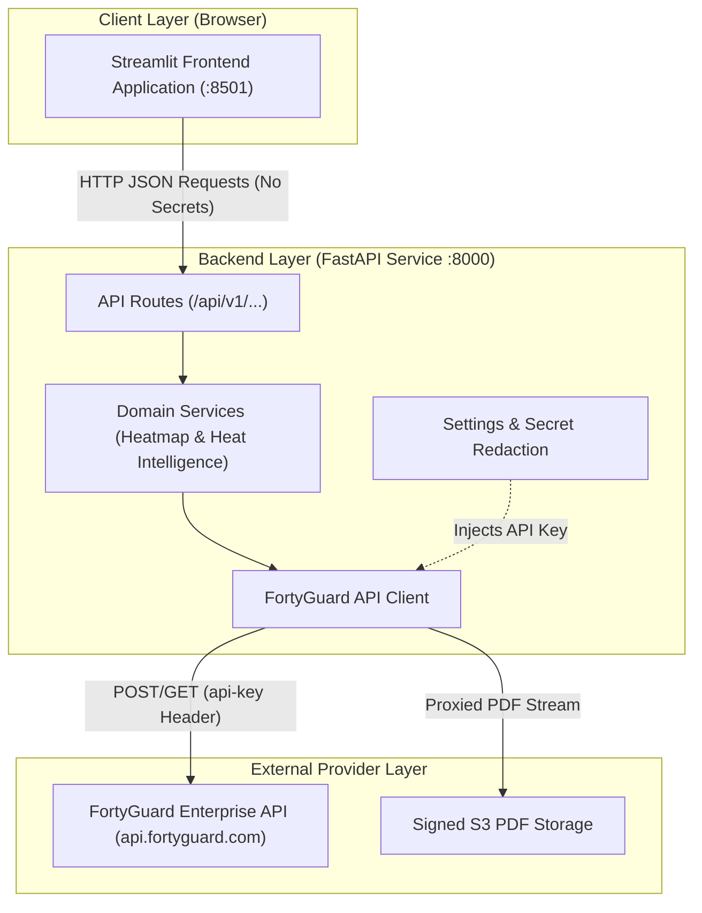
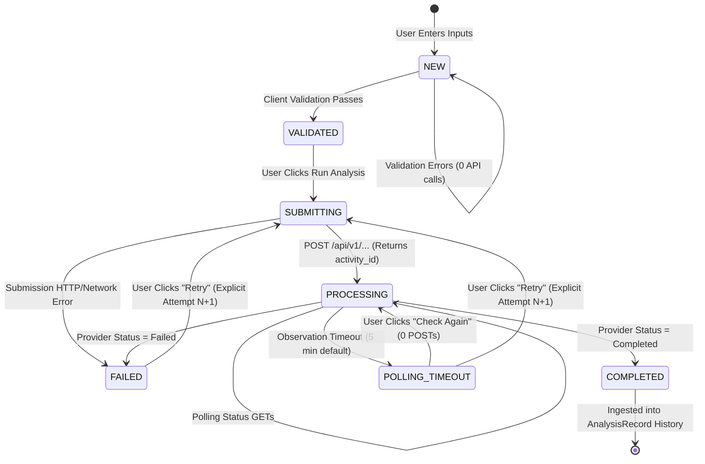

# FortyGuard Heat Intelligence — System Architecture

This document provides a comprehensive technical reference for the FortyGuard Heat Intelligence system architecture, component boundaries, execution lifecycles, and security invariants.

---

## 1. System Overview

FortyGuard Heat Intelligence is an explainable urban thermal analytics and operational decision-support platform. It interfaces with the FortyGuard Enterprise Temperature API to submit and poll asynchronous thermal analysis jobs, and provides a session-local operational intelligence engine that converts completed observations into actionable signals, alerts, prioritized investigations, and decision case briefs.



---

## 2. Component Boundaries & Responsibilities

The system enforces strict architectural boundaries across its tiers:

```
┌────────────────────────────────────────────────────────────────────────┐
│ STREAMLIT FRONTEND                                                     │
│ - Zero direct external provider calls                                  │
│ - Zero API keys or secrets in session state or memory                 │
│ - Local state machine for submission, polling, and timeout             │
│ - Deterministic Decision Intelligence & Operational Command Center     │
└───────────────────────────────────┬────────────────────────────────────┘
                                    │ HTTP (localhost:8000)
┌───────────────────────────────────▼────────────────────────────────────┐
│ FASTAPI BACKEND                                                        │
│ - Configuration management & secret redaction                          │
│ - Pre-flight payload validation & FortyGuard model mapping             │
│ - PDF download streaming proxy (prevents signed URL leakage)           │
│ - Bounded polling endpoints with exponential backoff & jitter          │
└───────────────────────────────────┬────────────────────────────────────┘
                                    │ HTTPS (api.fortyguard.com)
┌───────────────────────────────────▼────────────────────────────────────┐
│ FORTYGUARD ENTERPRISE API                                              │
│ - Asynchronous task orchestration (returns activity_id)                │
│ - Thermal modeling & GeoJSON heatmap tile computation                  │
│ - PDF report generation and temporary S3 signed link creation          │
└────────────────────────────────────────────────────────────────────────┘
```

### Tier Responsibilities Matrix

| Tier | Component | Responsibilities | Invariants |
|---|---|---|---|
| **Frontend** | `frontend/app.py` | Page routing, global theme injection, sidebar navigation | Never imports `FortyGuardClient` or touches `.env` |
| **Frontend** | `frontend/pages/` | `dashboard.py` (Command Center), `heatmap.py` (Spatial), `heat_intelligence.py` (Point) | Pure UI rendering; talks only to backend via `BackendAPIClient` |
| **Frontend** | `frontend/components/` | Reusable design system, metric cards, execution consoles, alert views | Zero business logic mutation; pure presentation |
| **Frontend** | `frontend/utils/` | Local engines: validation, history, signals, alerts, queue, priority, scenarios | 100% session-local; zero external HTTP requests |
| **Backend** | `backend/routes/` | REST routes for `health`, `heatmap`, `heat-intelligence` | Validates payloads and maps error responses |
| **Backend** | `backend/services/` | Business workflows, bounded polling orchestration | Manages async job lifecycles |
| **Backend** | `backend/api/` | HTTP client with retry logic, timeouts, and auth header injection | Sole holder of `FORTYGUARD_API_KEY` |
| **Backend** | `backend/models/` | Pydantic data schemas for requests, responses, and validation | Type-safe serializations |

---

## 3. Analysis Execution Lifecycle

The platform executes analysis requests through a centralized, deterministic state machine (`frontend/utils/analysis_execution.py`).



### Execution Semantics & Credit Safety Rules

1. **Submission Invariant**: Exactly 1 user submission triggers at most 1 provider activity creation (`POST`).
2. **Polling Invariant**: Polling status checks (`GET`) never consume analysis creation credits.
3. **Check Again Invariant**: Clicking **Check Again** after an observation timeout polls the existing `activity_id` and performs **zero** new POST submissions.
4. **Explicit Retry Invariant**: Clicking **Retry** displays an explicit credit consumption notice and creates Attempt $N+1$ linked to `parent_activity_id`. Zero automatic background retries exist.

---

## 4. Local Intelligence Architecture (Zero-Network Boundary)

Once an analysis reaches `COMPLETED`, the response payload is structurally validated and stored in `st.session_state` as an immutable `AnalysisRecord`. 

All subsequent analytical engines operate entirely in-memory with **zero external network requests**:

```
 AnalysisRecord (Immutable Source of Truth)
   │
   ├──► Watchlist Engine (frontend/utils/watchlist_engine.py)
   │      └── Match criteria & hysteresis evaluation
   │
   ├──► Signal Engine (frontend/utils/operational_intelligence.py)
   │      └── Threshold, delta, persistence, and data quality signals
   │
   ├──► Priority Engine (frontend/utils/priority.py)
   │      └── Deterministic scoring: Severity + Magnitude + Recency + Persistence
   │
   ├──► Alert Engine (frontend/utils/alert_engine.py)
   │      └── Promotion, suppression, cooldown, and lifecycle state tracking
   │
   ├──► Decision Intelligence (frontend/utils/decision_intelligence.py)
   │      └── Pairwise delta comparisons & timeline tracking
   │
   ├──► Pattern Detection (frontend/utils/pattern_detection.py)
   │      └── Cross-analysis recurring condition & trend detection
   │
   ├──► Scenario Sandbox (frontend/utils/scenario_engine.py)
   │      └── Hypothetical what-if parameter delta modeling (never mutates history)
   │
   └──► Export Engine (frontend/utils/export.py)
          └── Decision Case Briefs & Evidence Bundles with SHA-256 provenance
```

---

## 5. Security & Isolation Boundaries

```
┌────────────────────────────────────────────────────────────────────────┐
│ TRUST ZONE: FRONTEND (UNTRUSTED BROWSER ENVIRONMENT)                   │
│ - No access to FORTYGUARD_API_KEY environment variable                │
│ - Receives only sanitized JSON payloads and proxied PDF byte streams   │
│ - Redaction filter strips all temporary signed URLs from export briefs │
└───────────────────────────────────┬────────────────────────────────────┘
                                    │ Boundary: HTTP (JSON / PDF Stream)
┌───────────────────────────────────▼────────────────────────────────────┐
│ TRUST ZONE: BACKEND (SECURE SERVER ENVIRONMENT)                        │
│ - Holds FORTYGUARD_API_KEY in memory (Settings)                        │
│ - Strips authorization headers from diagnostic representations        │
│ - Proxies S3 storage downloads to keep storage URLs internal           │
└───────────────────────────────────┬────────────────────────────────────┘
                                    │ Boundary: HTTPS with API Key Header
┌───────────────────────────────────▼────────────────────────────────────┐
│ TRUST ZONE: EXTERNAL PROVIDER                                          │
│ - FortyGuard API & Object Storage                                      │
└────────────────────────────────────────────────────────────────────────┘
```

---

## 6. Observability & Provenance

- **Structured Observability (`frontend/utils/observability.py`)**: In-memory FIFO event log capped at 500 records. Tracks analysis submissions, status checks, and errors.
- **Canonical Snapshot Hashing**: Every intelligence snapshot generates a deterministic SHA-256 hash representing all active signals, watchlist matches, alerts, and queue items.
- **Deterministic Time Control (`frontend/utils/clock.py`)**: All engines support injected `FrozenClock` instances for 100% reproducible time-dependent testing (recency decay, cooldown periods).
