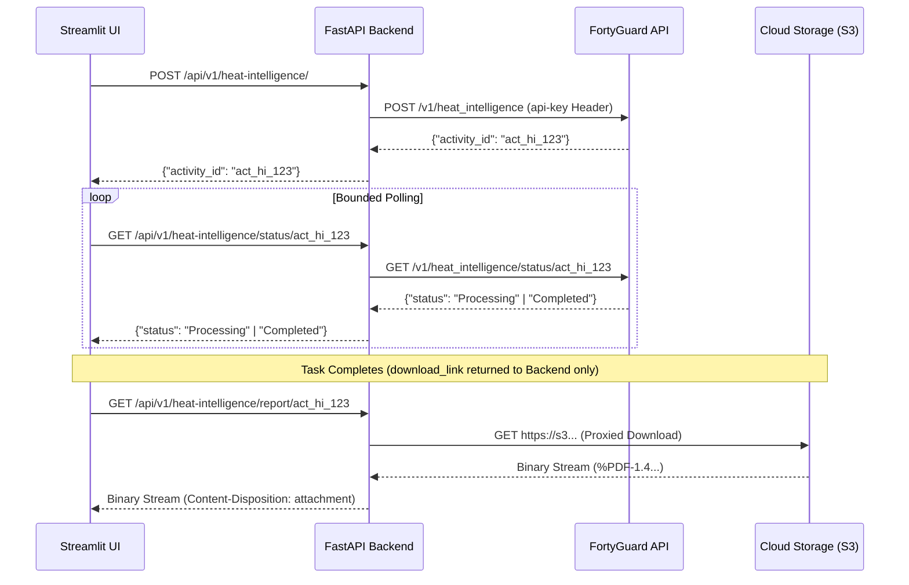

# FortyGuard Heat Intelligence — Point Analysis & PDF Reporting

This document details the point-based Heat Intelligence workflow, multi-dimensional category dimensions, asynchronous report generation, and the secure backend PDF streaming proxy.

---

## 1. What It Is & Why It Exists

Heat Intelligence provides point-specific multi-factor environmental intelligence. Unlike spatial heatmaps that cover wide polygons, Heat Intelligence focuses on a precise coordinate location, evaluating surface temperature alongside multi-dimensional urban categories (materials, vegetation, canopy, geometry, and resilience factors) and delivering an official comprehensive PDF report generated by FortyGuard.

---

## 2. Parameter Inputs & Analysis Dimensions

| Parameter | Validation Rules | Description |
|---|---|---|
| **Latitude & Longitude** | Float values: $-90.0 \le \text{lat} \le 90.0$, $-180.0 \le \text{lon} \le 180.0$. | Exact geographic point of interest. |
| **Observation Date** | Valid calendar date `YYYY-MM-DD`. | Baseline observation date. |
| **Observed Temperature** | Float value: $-100.0^\circ\text{C} \le T \le 100.0^\circ\text{C}$. | Ground truth or reference observed surface temperature. |
| **Analysis Categories** | Non-empty subset of confirmed categories. | Multi-dimensional analysis dimensions to evaluate. |

### Confirmed Analysis Categories
- **Thermal Intensity**: Baseline heat accumulation modeling.
- **Urban Morphology**: Building density and surface geometry effects.
- **Surface Material Properties**: Albedo, thermal emissivity, and pavement characteristics.
- **Vegetative Cooling**: Canopy cover and evapotranspiration indices.
- **Microclimate Resilience**: Composite vulnerability metrics.

---

## 3. Asynchronous Execution & Report Retrieval

---

## 4. Secure PDF Proxy Architecture

To maintain strict security isolation, the frontend **never receives or interacts with the temporary signed S3 URL**:
1. The signed URL returned by FortyGuard remains exclusively in backend memory.
2. When the user clicks **Download PDF Report**, the browser requests `/api/v1/heat-intelligence/report/{activity_id}`.
3. FastAPI fetches the PDF from object storage, validates the `%PDF-` header bytes, and streams the binary content directly to the user as a file download.
4. Storage expiration errors (HTTP 410) and network failures are translated into clean user alerts.
