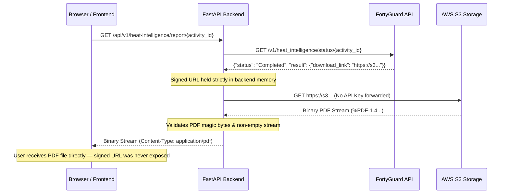

# FortyGuard Heat Intelligence — Security Architecture & Threat Model

This document specifies the security controls, credential isolation boundaries, data sanitization pipelines, and threat mitigation strategies implemented across the FortyGuard Heat Intelligence platform.

---

## 1. Security Principles

1. **Defense in Depth**: Isolation between frontend presentation, backend routing, and external provider communication.
2. **Principle of Least Privilege**: The browser/frontend client never receives, holds, or transmits provider API keys or persistent credentials.
3. **Zero Secret Persistence**: No secrets, auth tokens, or signed storage URLs are ever stored in browser session state or exported briefs.
4. **Data Sanitization by Default**: All data structures pass through recursive redaction pipelines before rendering in inspection consoles or export files.

---

## 2. Credential Isolation & Boundary Architecture

```
┌────────────────────────────────────────────────────────────────────────┐
│ STREAMLIT FRONTEND                                                     │
│ - Zero access to .env or environment secrets                           │
│ - Zero direct calls to api.fortyguard.com                              │
│ - All communication routed to FastAPI backend on localhost:8000        │
└───────────────────────────────────┬────────────────────────────────────┘
                                    │ HTTP Requests (No API Keys)
┌───────────────────────────────────▼────────────────────────────────────┐
│ FASTAPI BACKEND (Protected Boundary)                                   │
│ - Reads FORTYGUARD_API_KEY from environment via pydantic-settings      │
│ - Injects 'api-key' header exclusively in backend FortyGuardClient     │
│ - Redacts secrets from Settings repr/str and health diagnostic routes  │
└───────────────────────────────────┬────────────────────────────────────┘
                                    │ HTTPS (api-key: <REDACTED>)
┌───────────────────────────────────▼────────────────────────────────────┐
│ FORTYGUARD ENTERPRISE API                                              │
└────────────────────────────────────────────────────────────────────────┘
```

### Verified Implementation Safeguards

- **Backend Configuration (`backend/config.py`)**: `Settings` inherits from Pydantic `BaseSettings`. The `repr()` and `str()` representations explicitly mask API keys:
  ```python
  def __repr__(self) -> str:
      return f"Settings(environment={self.environment}, api_key_configured={self.fortyguard_api_configured})"
  ```
- **Health Check Routes (`backend/routes/health.py`)**: The `/api/v1/health` and `/api/v1/health/ready` endpoints return boolean flags (`fortyguard_api_configured: true|false`) and never expose the actual key string.
- **Frontend Isolation**: No frontend file imports `backend.config.get_settings` or accesses `os.environ["FORTYGUARD_API_KEY"]`.

---

## 3. Signed URL & PDF Proxy Architecture

When a Heat Intelligence point analysis completes, FortyGuard returns a temporary signed S3 download URL (`download_link`).

To prevent leaking the signed URL, S3 bucket metadata, or authentication query parameters to the browser:



### PDF Stream Hardening

- **Header Validation**: Verifies `%PDF-` magic header bytes in `backend/services/heat_intelligence_service.py` before streaming.
- **Header Stripping**: Does **not** forward the `api-key` header to third-party storage URLs (AWS S3), preventing credential leakage to storage endpoints.
- **Error Mapping**: Translates S3 HTTP 410 (Expired link), 404 (Not Found), 429 (Rate limited), and 502 (Storage failure) into clean, user-facing error codes.

---

## 4. Recursive Data Sanitization Pipeline

The application incorporates a deep recursive sanitization engine (`frontend/utils/export.py` and `frontend/utils/responsible_analytics.py`) applied to all:
- Developer JSON inspection expanders
- Investigation brief text/JSON downloads
- Command Center Decision Case Brief exports
- In-memory session history snapshots

### Redaction Rules

| Sensitive Target | Detection Pattern | Replacement / Redaction Action |
|---|---|---|
| API Keys / Tokens | Keys containing `key`, `token`, `secret`, `auth`, `password` | Replaced with `"[REDACTED_SECRET]"` |
| Signed S3 / Cloud URLs | String values matching `https://*?*Signature=*` or `AWSAccessKeyId` | Replaced with `"[REDACTED_SECURE_SIGNED_URL]"` |
| Internal Storage Paths | Absolute local paths (`C:\...`, `/home/...`) | Sanitized to relative workspace paths |

---

## 5. Threat Model & Trust Boundaries

| Threat Scenario | Potential Impact | Implemented Mitigation |
|---|---|---|
| **Client-Side Inspection** | Exposing API keys via DevTools or session state inspection | API keys exist only in FastAPI backend memory; never transmitted to browser. |
| **Signed Storage URL Leakage** | Exposing temporary S3 links with expiration timestamps and bucket identities | Backend proxies all PDF downloads; frontend only receives pure binary streams. |
| **Credit Exhaustion Attack** | High-frequency automated polling or page refreshes depleting API budget | Bounded polling with configurable limits; polling operations use GET only; explicit retry gating. |
| **Hostile Payload Injection** | Malformed GeoJSON or NaN/Inf temperature inputs crashing state engines | Strict pre-flight validation core (`validation.py`); structural schema adapters before history ingestion. |
| **Misleading Analytical Claims** | Presenting derived data as official medical/causal forecasts | Centralized Responsible Analytics enforcement stripping causal language and appending disclaimers. |

---

## 6. What the Platform Explicitly DOES NOT Do

To maintain strict auditability, the system guarantees:
- ❌ **NO API keys** in Streamlit source code, frontend session state, or exported files.
- ❌ **NO signed cloud storage URLs** exposed in frontend UI or network inspect tabs.
- ❌ **NO persistent databases** storing user session records (100% session-local).
- ❌ **NO unvetted third-party telemetry** or tracking scripts injected into UI.
- ❌ **NO automatic retries** on failed provider tasks that could silently drain API credits.
